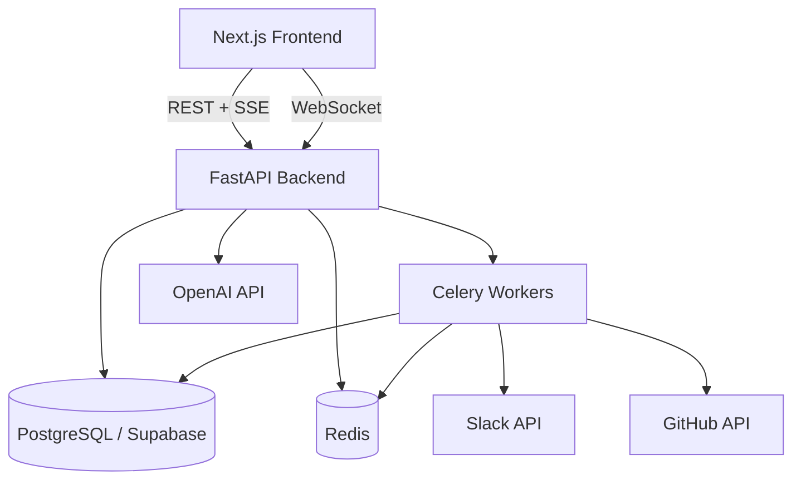

# 🚀 ProjectHub

ProjectHub is a modern, full-stack project management platform designed for efficiency and collaboration. It features AI integration, GitHub synchronization, real-time chat, and a beautiful premium UI.

> ✅ GitHub webhook integration verified — push events trigger AI-summarized commit feeds in real-time.

## 🐳 Quick Start (Docker)

```bash
git clone https://github.com/Yuvraj686/PM-cv.git
cd PM-cv
cp backend/.env.example backend/.env       # fill in your values
cp frontend/.env.example frontend/.env.local
docker compose up --build
```

- 🌐 **App** → [http://localhost:3000](http://localhost:3000)
- 📡 **API docs** → [http://localhost:8000/docs](http://localhost:8000/docs)
- ❤️ **Health** → [http://localhost:8000/health](http://localhost:8000/health)
- ✅ **Readiness** → [http://localhost:8000/ready](http://localhost:8000/ready)

---

## ✨ Key Features

- **📊 Project & Task Management**: Intuitive Kanban boards with column state tracking, status transitions, drag-and-drop operations, story point tracking, assignee management, and custom due dates.
- **💬 Real-time Presence & Collaboration**: WebSocket room-based updates for real-time name edits, task drags, activity feeds, instant chat messaging, and concurrent user presence indicators.
- **🤖 Advanced AI Planner**: AI-powered sprint goal task generator, interactive accepted-tasks checklist, auto-persisted Kanban cards, AI usage counter, and an advanced automated Risk Analyzer.
- **🔗 GitHub Sync & Webhooks**: Bi-directional integration mapping, repository sync endpoints, commit history visualization, and custom webhook listener for GitHub push events.
- **🔔 Smart Notifications**: Multi-channel delivery system supporting real-time WebSocket notifications, Slack channel messages, and email dispatch with Resend.
- **🛡️ Multi-Modal Secure Auth**: Standard email/password signup, password strength score bar, Google OAuth, GitHub OAuth, phone number verification with 6-digit OTP countdown, rate limiting, and JWT tokens.
- **📈 Rich Analytics Charts**: Beautiful burndown charts (days vs story points), team workload distribution charts, and historical velocity bars generated dynamically via Recharts.
- **📱 Premium responsive UI/UX**: SLEEK dark-mode premium styles, glassmorphism, responsive mobile layouts, dynamic micro-animations, loading skeletons, and strict type safety.

---

## 🔑 Required Environment Variables

Configure these variables in your `backend/.env` file to fully enable all ProjectHub features:

| Service | Environment Variable | Purpose / Where to Get It |
| :--- | :--- | :--- |
| **Database** | `DATABASE_URL` | Supabase PostgreSQL connection string (pooled on port 6543) |
| **Redis** | `REDIS_URL` | Redis server connection URI (default: `redis://localhost:6379/0`) |
| **Security** | `SECRET_KEY` | 256-bit base64-encoded string for JWT signatures |
| | `ENCRYPTION_KEY` | Fernet-compatible key to encrypt credentials in DB |
| **AI Models** | `OPENAI_API_KEY` | OpenAI API Key (required for task generation and risk analyzer) |
| | `ANTHROPIC_API_KEY` | Anthropic Claude API Key (optional fallback model) |
| | `AI_DAILY_LIMIT` | Maximum daily requests per user to manage API expenses |
| **GitHub** | `GITHUB_WEBHOOK_SECRET` | Secret configured in GitHub repository webhook |
| | `GITHUB_TOKEN` | GitHub Personal Access Token (PAT) for repo synchronization |
| **Email** | `EMAIL_API_KEY` | Resend API Key for dispatching verification and reset emails |
| | `FROM_EMAIL` | Sender address (default: `noreply@projecthub.app`) |
| **OAuth** | `GITHUB_CLIENT_ID` / `_SECRET` | GitHub Developer Console OAuth App credentials |
| | `GOOGLE_CLIENT_ID` / `_SECRET` | Google Cloud Console OAuth 2.0 Credentials |
| | `SLACK_CLIENT_ID` / `_SECRET` | Slack App Console OAuth Client credentials |
| **App Configuration** | `FRONTEND_URL` | Next.js frontend base URL (default: `http://localhost:3000`) |
| | `ENV` / `APP_NAME` | Deployment environment state and branding name |


## 🛠️ Technology Stack

### Backend
- **Framework**: FastAPI (Python 3.12)
- **Database**: PostgreSQL (via Supabase)
- **Task Queue**: Celery with Redis
- **Real-time**: WebSockets
- **Authentication**: JWT & OAuth2 (Google/GitHub)

### Frontend
- **Framework**: Next.js 14 (App Router)
- **Styling**: TailwindCSS & Framer Motion
- **UI Components**: Shadcn/UI & Bloom Design System
- **State Management**: Zustand
- **Real-time**: Socket.IO-client

---

## 🚀 Getting Started

### Prerequisites
- Python 3.12+
- Node.js 18+
- Docker Desktop (Running for Redis and local flows)

### 1. External Service Configuration
Configure your authorized redirect URIs in the Google and GitHub developer consoles:
- `http://localhost:8000/api/auth/google/callback`
- `http://localhost:8000/api/auth/github/callback`

### 2. Start Support Services (Redis)
```powershell
docker-compose up -d redis
```

### 3. Setup Backend
1. Navigate to the backend directory:
   ```bash
   cd backend
   ```
2. Create and activate a virtual environment:
   ```bash
   python -m venv .venv
   .\.venv\Scripts\activate
   ```
3. Install dependencies:
   ```bash
   pip install -r requirements.txt
   ```
4. Configure your `.env` file with your credentials (Supabase, OpenAI, GitHub, Twilio, etc.).
5. Run the server:
   ```bash
   uvicorn main:app --reload --port 8000
   ```

### 4. Setup Frontend
1. Navigate to the frontend directory:
   ```bash
   cd frontend
   ```
2. Install dependencies:
   ```bash
   npm install
   ```
3. Run the development server:
   ```bash
   npm run dev
   ```
The application will be live at: **http://localhost:3000**

---

## 🛡️ Development Setup

### Pre-commit Hooks

This project uses [pre-commit](https://pre-commit.com/) to enforce code quality and prevent secrets from being committed.

**Hooks included:**
- **gitleaks** — Scans for hardcoded secrets and API keys
- **ruff** — Fast Python linting
- **black** — Python code formatting
- **eslint** — TypeScript/JavaScript linting (frontend)

**Installation:**

1. Install pre-commit:
   ```bash
   pip install pre-commit
   ```

2. Install the git hooks:
   ```bash
   pre-commit install
   ```

3. (Optional) Run against all files:
   ```bash
   pre-commit run --all-files
   ```

> **Note:** You need [gitleaks](https://github.com/gitleaks/gitleaks#installing) installed on your system for the secrets scanning hook.

---

## 🛠️ Maintenance & Troubleshooting
- **Logs**: Backend logs provide visibility into OTP codes and OAuth status.
- **Database**: Hosted on Supabase for scalability and reliability.
- **Performance**: Production builds (`npm run build`) are optimized with `<Suspense>` boundaries.

---
# Architecture


*Created with ❤️ by Yuvraj686*
